# Current Design

This document describes the architecture of the Confluent Kafka Rust client as
it stands. The dated, step-by-step record of how it got here lives in
`design/history/` (`MILESTONES.md` plus one directory per milestone); what is
done and what is not is tracked in [status.md](status.md).

**Last verified against the tree:** 2026-08-13
**Coverage:** Producer, Consumer (KIP-848) and AdminClient are all translated;
the C FFI and the Python bindings cover producer + consumer, not admin.

---

## Overview

A Rust Kafka client translated from the Java Kafka client (Apache Kafka 4.2), preserving the same
architecture and logical structure while adapting to Rust idioms. All I/O is async via Tokio.

**Crate stats:** 566 source files under `src/`, ~219,000 lines, **3172 lib
tests** (`cargo test --lib -- --list`) plus 166 `#[tokio::test]`s across 28
feature-gated integration files (and further cases generated by the
multilanguage test macro).

> **Diagrams:** every image lives in `img/` — each `` below
> is rendered from the `.d2` file of the same name beside it, and the `.d2` is
> the source of truth, so never hand-edit an `.svg`.

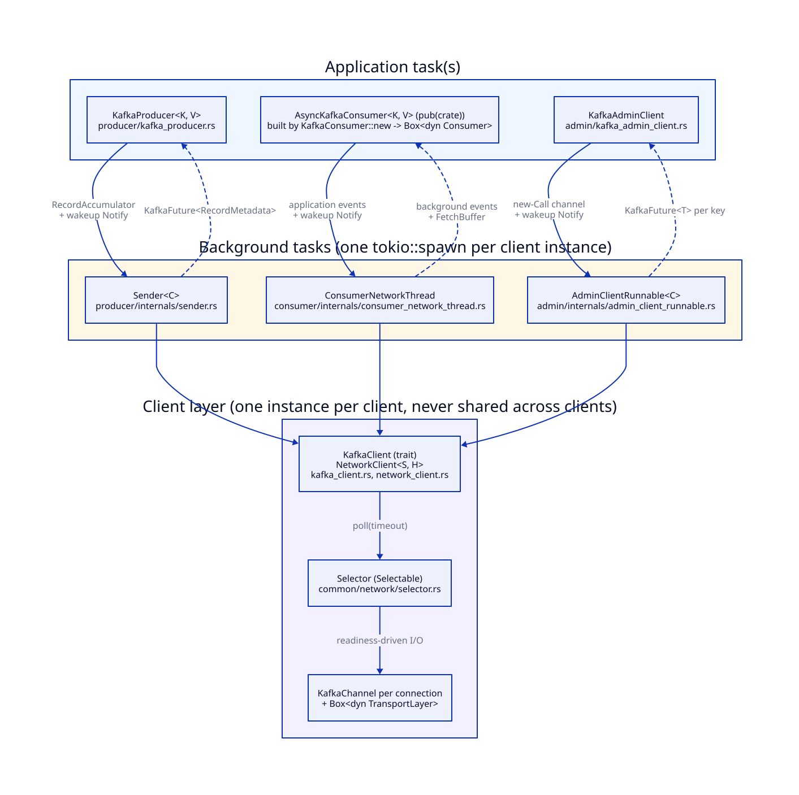

*Take away: three independent clients, each owning exactly one background
task and one `NetworkClient`; the app side communicates with its background
task through channels plus a wakeup `Notify`, never by sharing a lock.*

---

## Layered Architecture

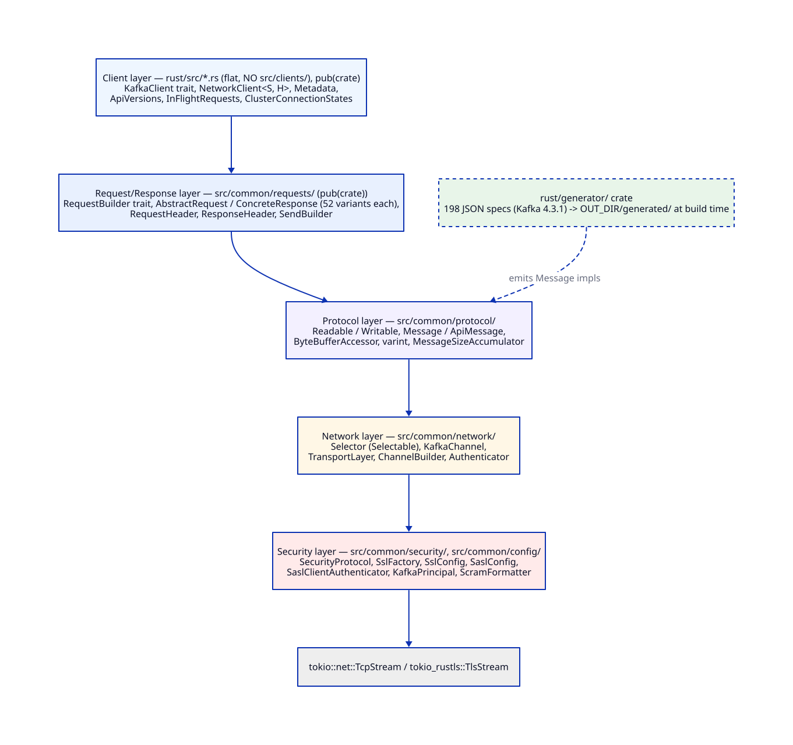

*Take away: each layer depends only on the one below it, so a change to the
transport never reaches the request/response types; the `generator/` crate is
the one input from outside the stack, emitting `Message` impls into the
protocol layer at build time.*

> **Path note:** the client layer has no `src/clients/` directory — CLAUDE.md
> §2 forbids `clients` in a folder name, so `kafka_client.rs`,
> `network_client.rs`, `metadata.rs`, `api_versions.rs`,
> `in_flight_requests.rs`, `cluster_connection_states.rs` and friends live
> flat at the crate root (`src/lib.rs:18-47`). Any `src/clients/...` path
> elsewhere in this directory (`status.md` still carries a few) should be read
> as `src/...`.

Above this stack sit the three client modules — `src/producer/`,
`src/consumer/`, `src/admin/` — each with its own background task
(see [Client Modules](#client-modules) below).

---

## Network Stack

### TransportLayer trait (`common/network/transport_layer.rs`)

Core abstraction bridging Java NIO and Tokio async I/O. Object-safe trait
(`Box<dyn TransportLayer>`) for runtime dispatch.

**Key methods:** `read`, `write`, `write_vectored`, `handshake`, `finish_connect`, `disconnect`

**Implementations:**
- `PlaintextTransportLayer` -- wraps `tokio::net::TcpStream`
- `SslTransportLayer` -- wraps `tokio_rustls::TlsStream<TcpStream>`, state machine: Handshaking -> Ready -> Closed

### Selector (`common/network/selector.rs`)

Multiplexes I/O across multiple `KafkaChannel` instances. Implements the `Selectable` trait.

**NIO to Tokio mapping:**
- Java `SelectionKey` -> eliminated; channels keyed by `Arc<str>` ID in an `FxHashMap`
- Java `selectedKeys()` -> a shared **fired queue** (`ready_queue: Arc<ReadyQueue>`)
  that per-channel `ChannelWaker`s push into when the tokio reactor fires them
  (`selector.rs:254-259`)
- Wakeup via `tokio::sync::Notify`
- Idle timeout via `IdleExpiryManager`

**Poll cycle (readiness-driven, not a full sweep):**
1. The WAIT future drains the fired queue, translating `(token, is_write)` pairs
   back to channel ids via `token_to_id` (`selector.rs:265-269`)
2. Pass 1 processes only the *ready* ids (plus channels with buffered reads and
   immediately-connected channels), rather than issuing a `recv` syscall on every
   registered channel
3. A readable channel is drained in a **tight `try_read` loop** until the socket
   is empty (`selector.rs:765`), instead of one chunk per async round-trip
4. `interest_dirty` forces a re-arm for any channel whose interest may have
   flipped on since it was last armed (`selector.rs:272-278`) — a missed arm is a
   data-stall bug, so the rule is "when in doubt, mark dirty"
5. Return completed sends/receives and disconnected channels


*Take away: the poll touches only the channels the tokio reactor fired, and a
wakeup returns the WAIT future without losing state — the scratch sets are
struct fields, not future-locals, precisely so a cancelled WAIT costs nothing.*

`FxHashMap`/`FxHashSet` (not SipHash) are used for the per-poll channel maps:
the keys are internal connection ids, and hashing them showed up as ~10% of CPU
in a TLS profile (`selector.rs:203-209`). The raw flat profile that measurement
came from is kept beside this document as `tls-profile-phase21-flat.txt`.

> The `Selector` doc comment's own "Key adaptations" summary
> (`selector.rs:190-194`) still says *"NIO `Selector.select()` → sequential
> try_read/try_write + tokio timeout"*. That describes a sweep-every-channel
> design that no longer exists; the struct's fields and the poll body implement
> the readiness-driven design described above. The comment is stale, not the
> code.

### KafkaChannel (`common/network/kafka_channel.rs`)

Per-connection state machine combining transport, authentication, and I/O buffers.

**Contains:**
- `Box<dyn TransportLayer>` -- the underlying transport
- `Box<dyn Authenticator>` -- authentication handler
- `Option<NetworkSend>` / `Option<NetworkReceive>` -- I/O buffers
- `ChannelState` (`channel_state.rs:81`) -- a struct
  `{ state: State, error: Option<String>, remote_address: Option<..> }`; the
  lifecycle enum it carries is `State` (`channel_state.rs:45`):
  `NotConnected`, `Authenticate`, `Ready`, `Expired`, `FailedSend`,
  `AuthenticationFailed`, `LocalClose`. The file also exposes the
  `NOT_CONNECTED` / `AUTHENTICATE` / `READY` / `EXPIRED` consts Java has as
  static fields (`channel_state.rs:128-134`)
- `ChannelMuteState` -- read muting for backpressure

### ChannelBuilder trait (`common/network/channel_builder.rs`)

Factory for creating `KafkaChannel` instances from a `TcpStream`.

**Implementations:**
- `PlaintextChannelBuilder` -- creates plaintext channels
- `SslChannelBuilder` -- creates SSL/TLS channels with rustls
- `SaslChannelBuilder` -- creates SASL-authenticated channels (SASL_PLAINTEXT, SASL_SSL)

**Factory:**
- `client_channel_builder()` (`channel_builders.rs`) -- dispatches on `SecurityProtocol` to create the appropriate builder

### Network I/O Primitives

- `KafkaSend` trait (`send.rs`) -- async send; impl: `ByteBufferSend`
- `Receive` trait (`receive.rs`) -- async receive; impl: `NetworkReceive`
- `NetworkSend` (`network_send.rs`) -- wraps `KafkaSend` with destination ID
- `NetworkReceive` (`network_receive.rs`) -- size-delimited receive (4-byte header + payload)

---

## Protocol Framework

### Serialization Traits (`common/protocol/`)

- `Readable` -- deserialize Kafka types from byte streams
- `Writable` -- serialize Kafka types to byte streams
- `ByteBufferAccessor` -- concrete impl of both traits over `&mut [u8]`
- `Message` -- versioned serialization: `size()`, `add_size()`, `write()`, `read()`
- `ApiMessage` -- extends Message with `api_key()`

Two-pass serialization: calculate size first, then serialize.

### Wire Format

- Big-endian for all multi-byte integers
- Varint/varlong: Protocol Buffers unsigned and zig-zag signed encoding
- Strings: i16 length prefix (standard) or varint(len+1) (flexible)
- Bytes: i32 length prefix (standard) or varint(len+1) (flexible)
- Arrays: i32 length prefix (standard) or varint(len+1) (flexible)
- Tagged fields at end of struct in flexible versions

Flexibility is decided **per field**, not per message: the generator calls
`field_flexible_versions(field, msg_flex)` so overrides like `RequestHeader`'s
`ClientId` (`"none"`, always length-prefixed) encode correctly (CLAUDE.md §2).

---

## Request/Response Framework (`common/requests/`)

### RequestBuilder trait (`abstract_request.rs`)

Constructs requests at a specific API version. Replaces Java's `AbstractRequest.Builder`.

Methods: `api_key()`, `oldest_allowed_version()`, `latest_allowed_version()`,
`build()`, `build_version()` (`abstract_request.rs:138-160`)

### Dispatch Enums

`ConcreteRequest` / `ConcreteResponse` are **enums**, one variant per API, and
adding an RPC means wiring every `match` arm (`version`, `api_key`, `to_send`,
`serialize_with_header`, `serialize`, `get_error_response`, `parse_*`).

**48 variants** are wired today (`abstract_request.rs`):

| Group | Variants |
|-------|----------|
| Core | ApiVersions, Metadata, Produce, Fetch |
| Security | SaslHandshake, SaslAuthenticate |
| Coordination | FindCoordinator, ConsumerGroupHeartbeat, LeaveGroup |
| Groups | ListGroups, DescribeGroups, ConsumerGroupDescribe, DeleteGroups |
| Offsets | ListOffsets, OffsetsForLeaderEpoch, OffsetCommit, OffsetFetch, OffsetDelete |
| Topics | CreateTopics, DeleteTopics, CreatePartitions, DeleteRecords |
| Configs | DescribeConfigs, IncrementalAlterConfigs, ListConfigResources |
| Cluster | DescribeCluster, DescribeLogDirs, AlterReplicaLogDirs, ElectLeaders, AlterPartitionReassignments, ListPartitionReassignments, UpdateFeatures |
| ACLs / quotas | DescribeAcls, CreateAcls, DeleteAcls, DescribeClientQuotas, AlterClientQuotas |
| Credentials | DescribeUserScramCredentials, AlterUserScramCredentials, Create/Renew/Expire/DescribeDelegationToken |
| Transactions | InitProducerId, WriteTxnMarkers, DescribeProducers, DescribeTransactions, ListTransactions |

The variant list is exactly the set an RPC can name; anything absent from it
cannot be sent, however complete the generated message type is. `ListOffsets`
is shared — the consumer's wrapper backs the admin `list_offsets` too, rather
than a second wire type being added.

### Supporting Types

- `RequestHeader` / `ResponseHeader` -- Kafka frame headers
- `SendBuilder` -- constructs `NetworkSend` from header + body (zero-copy)

---

## Client Layer (`src/*.rs`)

### KafkaClient trait (`kafka_client.rs`)

Defines the client interface: `is_ready`, `ready`, `send`, `poll`, `disconnect`,
`least_loaded_node`, `in_flight_request_count`, `wakeup_handle`, etc.
`wakeup_handle()` returns the selector's `Arc<Notify>` and is how every
background task is interrupted without cancelling an in-flight poll.

### NetworkClient<S: Selectable, H: HostResolver> (`network_client.rs`)

Core async client implementation (`network_client.rs:91`), generic over
`Selectable` (for test injection via `MockSelector`) and `HostResolver`. The
struct is `pub` but its module is not — `lib.rs:39` declares
`pub(crate) mod network_client`, so outside the crate the type is reachable
only through the `KafkaClient` trait.

**Manages:**
- `InFlightRequests` -- per-destination request queue
- `ClusterConnectionStates<H>` -- connection state machine with exponential backoff
- `ApiVersions` -- cached per-node API version registry
- Metadata updates and recovery

### Connection State Machine


*Take away: a node is marked `Connecting` before its socket exists, so a
dropped network-poll future strands it — this is the reason no background task
races its poll in a `select!`.*

`ConnectionState` (`src/connection_state.rs:29-33`) has five states; the
transitions are the `ClusterConnectionStates` methods of the same names —
`connecting` (`cluster_connection_states.rs:163`), `checking_api_versions`
(`:268`), `ready` (`:279`), `authentication_failed` (`:292`), `disconnected`
(`:215`) — each carrying the exponential-backoff bookkeeping.

`initiate_connect` marks a node `Connecting` **before** it awaits
`current_address()` / `selector.connect()`, so the poll that drives it is *not*
cancellation-safe — see the note under [Consumer](#consumer-srcconsumer).

### Request/Response Flow

1. `NetworkClient::send(ClientRequest)` -- queues request
2. `RequestBuilder::build_version()` -> `ConcreteRequest`
3. `Message::write()` -> bytes, wrapped in `SendBuilder` -> `ByteBufferSend` -> `NetworkSend`
4. `Selector::poll()` drives I/O via `KafkaChannel` -> `TransportLayer`
5. Response: `TransportLayer::read()` -> `NetworkReceive` -> `Message::read()` -> `ClientResponse`
6. `RequestCompletionHandler` callback invoked

### Supporting Types

- `ClientRequest` / `ClientResponse` -- request/response wrappers with metadata
- `RequestCompletionHandler` -- `Box<dyn FnOnce(&mut ClientResponse) + Send>` (`lib.rs:57`)
- `Metadata` -- thread-safe metadata cache with epoch tracking
- `MetadataSnapshot` -- immutable cluster metadata snapshot
- `NodeApiVersions` -- per-node API version tracking

---

## Client Modules

### Producer (`src/producer/`)

`Producer<K, V>` (`producer_trait.rs:38`) declares six methods, all `async`:
`send`, `send_with_callback`, `flush`, `partitions_for`, `close`,
`close_timeout`. `KafkaProducer<K, V>` (`kafka_producer.rs:912`) and
`MockProducer<K, V>` (`mock_producer.rs:295`) implement it.

Unlike `Consumer` and `Admin`, this trait does **not** use `#[async_trait]`:
it uses native `async fn` in trait under `#[allow(async_fn_in_trait)]`
(`producer_trait.rs:37`). The consequence is that it is not dyn-compatible and
there is no `Box<dyn Producer>` anywhere in the tree — callers name the
concrete type or take `impl Producer<K, V>`. Transactional methods
(`init_transactions`, `begin_transaction`, `commit_transaction`,
`abort_transaction`, `send_offsets_to_transaction`) are not part of the trait.

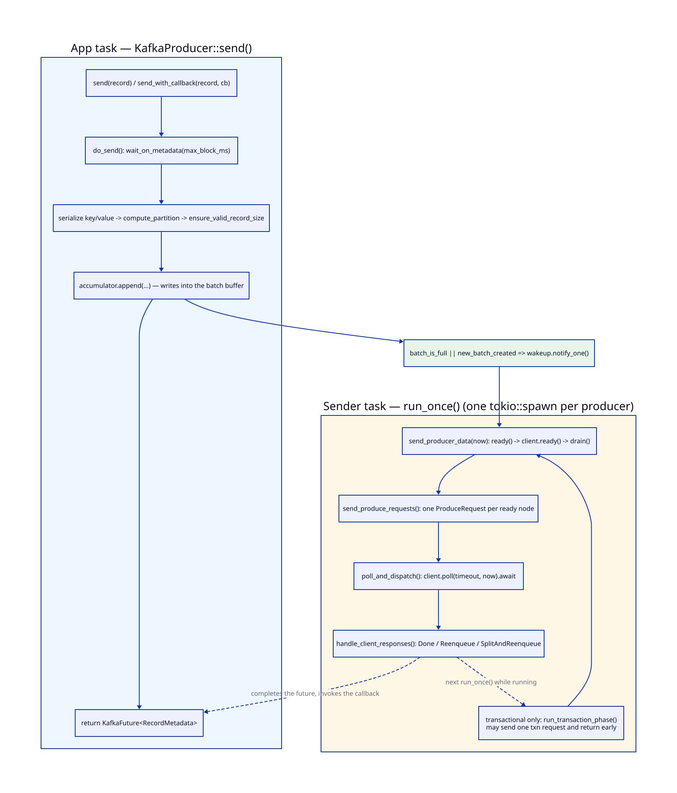

*Take away: `send()` never touches the network — it appends into the
`RecordAccumulator` and returns a future; the `Sender` task does all I/O and
completes the future later.*

The app-side path is `do_send` (`kafka_producer.rs:486`) →
`wait_on_metadata(max_block_ms)` → serialize key/value → choose partition
(explicit → `BuiltInPartitioner::partition_for_key` → `UNKNOWN_PARTITION`) →
`ensure_valid_record_size` → `accumulator.append(...)`. The sender is woken
only when the append filled a batch or started a new one
(`kafka_producer.rs:604-611`), matching Java.

The `Sender<C>` task (`internals/sender.rs:173`) loops `run_once()`
(`sender.rs:213`): `send_producer_data(now)` (`sender.rs:346`, which drains the
accumulator and builds one `ProduceRequest` per ready node in
`send_produce_requests`, `sender.rs:902`) → `client.poll(...)` →
`handle_produce_responses(...)` (`sender.rs:230`). On shutdown it keeps looping
while the accumulator has undrained batches or requests are in flight, then
`abort_incomplete_batches()` on a force close (`sender.rs:186-197`).

Because Rust closures cannot capture `&mut self`, Java's
`RequestCompletionHandler` → `handleProduceResponse` callback is translated as
processing the responses `poll()` returns, with per-batch outcomes
(`Reenqueue` / `SplitAndReenqueue` / `Done`) applied afterwards
(`sender.rs:230-273`).

### Consumer (`src/consumer/`)

`Consumer<K, V>` is a single `#[async_trait]` trait (`src/consumer/mod.rs:151`)
with 46 methods; `new_consumer(...)` returns `Box<dyn Consumer<K, V>>`
(`mod.rs:488`). 37 of the 46 are `async` — the ones that block in Java; the
nine sync ones are `assignment`, `subscription`, `paused`, `group_metadata`,
`client_id`, `current_lag`, `metrics`, `wakeup` and `handle`. Implementations:
`AsyncKafkaConsumer<K, V>` and `MockConsumer<K, V>`. A compile-time guard on
this shape lives at `tests/consumer/trait_surface_check.rs`.

Only the KIP-848 group protocol is translated. `new_consumer` rejects
`group.protocol=classic` with an `unsupported_version` error rather than
silently degrading, and the client-side assignors (`RangeAssignor`,
`StickyAssignor`, …) have no Rust counterpart because KIP-848 assigns
server-side (`consumer-threading.md` §20). Two pieces of the classic protocol
*are* present, because the admin group-describe path needs them:
`ConsumerProtocol` (`internals/consumer_protocol.rs`) and the `Assignment` /
`Subscription` data holders (`consumer_partition_assignor.rs`).


*Take away: one `run_once()` iteration walks Java's `runOnce()` phases in
order, and phase 4 (the network poll) runs to completion — it is never raced
in a `select!`.*

The phase labels are the ones the code itself uses, and they follow Java's
`ConsumerNetworkThread.runOnce()`. There is no phase 3 because Java visits the
membership manager inside its `entries()` walk, whereas Rust's `entries()`
(`request_managers.rs:207`) skips the three `Arc`-shared managers —
coordinator, commit, membership — since a `&mut dyn RequestManager` cannot be
produced from a shared `Arc`. Their side effects are re-supplied explicitly at
phases 2, 2.4, 2.5 and 2.6 (`consumer_network_thread.rs:426-615`), in Java's
order: coordinator → commit → heartbeat → *reconcile* → offsets →
topic_metadata → fetch. Keeping `reconcile` in the middle is what guarantees
that `offsets.poll()` / `fetch.poll()` observe post-reconcile subscription
state within the same iteration.

**Phase 4 is a plain `.await`, deliberately.** A `tokio::select!` racing the
poll against a wakeup token and an application-event `Notify` cancels the poll
mid-`initiate_connect`, leaving a node marked `Connecting` with no socket until
the ~10 s connection-setup timeout — which stalls group joins intermittently
and indefinitely. Wakeups therefore go to the selector's own `Arc<Notify>`
(`KafkaClient::wakeup_handle()`), so the poll returns at a safe boundary
instead of being dropped; `notify_one()` stores a permit, so a poke that lands
between the top-of-loop drain and the await still returns the poll immediately
(`consumer_network_thread.rs:617-654`, poll at `:654`).

> The root-cause analysis behind that rule was written up in
> `design/current/consumer-join-stall-rootcause.md`. **That file is staged for
> deletion and is no longer present in the working tree** (its content remains
> in git history; the fix is commit `9966df19`). Its conclusion — *the network
> poll performs side-effecting connection setup before an `await`, so it must
> never be a `select!` loser* — is preserved in `consumer-threading.md` §10,
> which is also one of the live references that now dangles; the others are
> listed in [status.md](status.md)'s document-inventory note.

> The module docstring at `consumer_network_thread.rs:42-45` still describes
> phase 4 as *"wrapped in `tokio::select!` against the current wakeup token
> and the shutdown signal"*. That describes the shape that caused the stall;
> the body at line 654 is authoritative.


*Take away: `ConsumerRebalanceListener` and `OffsetCommitCallback` run inline
on the caller's task; the background loop keeps spinning during the callback
and gates only the membership state transition on the ack.*

The handshake is `BackgroundEvent::ConsumerRebalanceListenerCallbackNeeded
{ method_name, partitions, ack: oneshot::Sender<Result<(), KafkaError>> }`
(`internals/events/background_event.rs:49-57`). The app side drains it in
`process_background_events` (`async_kafka_consumer.rs:3134`), invokes the
listener, sends the ack and pokes the bg `Notify`. The bg side stores the
receiver and `try_recv`s it each iteration —
`ConsumerMembershipManager::drive_pending_release`
(`consumer_membership_manager.rs:1105`) and the reconcile equivalent — so a
listener that reenters the consumer through a `ConsumerHandle`
(`async_kafka_consumer.rs:186`) cannot deadlock.

Blocking the bg loop on that ack instead would deadlock any consumer call the
listener makes: the listener runs on the app task, whose `poll()` cannot return
until the listener does, so the loop that would service the reentrant call must
stay free. Driving the ack with `try_recv` across iterations is what keeps
heartbeats and fetches flowing while a listener runs.

> `background_event.rs:45-48` and `:55-56` still say the bg task "`.await`s"
> the ack after enqueueing. That describes the earlier blocking shape; the
> manager code is authoritative.


*Take away: one buffer owns the fetch payload and everything downstream
borrows slices from it — the only per-record deep copy is the one the user's
`Deserializer` chooses to make.*

Receive-path zero-copy holds: fetched bytes are owned once by
`CompletedFetch`, the buffer is *moved* (never cloned) into a lazy
`BatchCursor` (`completed_fetch.rs:225`), compressed batches are decompressed
once per batch, the topic name is one `Arc<str>` per fetch cloned per record,
and `Deserializer<T>` is a sync trait taking `&[u8]`
(`completed_fetch.rs:29-52`, `common/serialization/deserializer.rs:52`).
Headers are the one deliberate owned copy per record, matching Java's
allocation behaviour.

### Admin (`src/admin/`)

The `Admin` trait (`src/admin/mod.rs:249`) has **46 sync `fn` RPC methods and
exactly one `async fn` (`close`)**, the shape `.claude/rules/admin-client.md`
§1 requires. `new_admin_client(config)` (`mod.rs:655`) returns
`Box<dyn Admin>`; `KafkaAdminClient` and `MockAdminClient` implement it.

**Why sync methods, when the consumer's are async.** The distinguishing signal
is *where* the blocking happens in Java. `Consumer.poll()` itself performs I/O
and blocks, so it becomes `async`. `Admin.createTopics()` hands work to a
background thread and returns instantly with a `*Result` wrapping one
`KafkaFuture<T>` per key; blocking is opt-in, at `KafkaFuture.get()`. So per-RPC
methods stay plain `fn` that enqueue a `Call` and return a result struct, and
the caller awaits the futures it cares about. `close()` is `async` because
Java's `close(Duration)` joins the background thread. `#[async_trait]` sits on
the trait only so `close()` is dispatchable through `Box<dyn Admin>`; it does
not reach the internal `Call` / driver types, which are plain structs driven by
the background task.

`KafkaFuture<T>` (`common/kafka_future.rs`) is the type that makes this work.
The public view is `Clone` and re-awaitable (`get`, `get_timeout`, `is_done`,
`all_of`, `then_apply`, `then_apply_try`, `join_map`); the crate-internal
`KafkaFutureImpl<T>` (`kafka_future.rs:354`) is the completable handle
(`complete`, `complete_exceptionally`, `when_complete`, `future()`). It is
built on `Arc<Mutex<Option<Result>>>` + `Notify` rather than a `oneshot`
precisely because Java's `Future.get()` is re-callable by several callers.

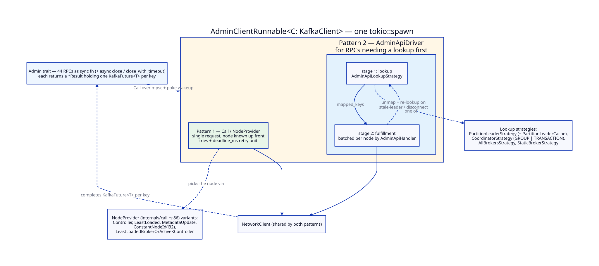

*Take away: both dispatch patterns share one background task and one
`NetworkClient`; the only difference is whether the target node is known up
front (`Call`) or must be looked up first (`AdminApiDriver`).*

Both patterns run on one `tokio::spawn`ed `AdminClientRunnable<C: KafkaClient>`
(`admin/internals/admin_client_runnable.rs:88`), which mirrors the producer's
`Sender<C>` and walks the phases of Java's `AdminClientRunnable.run()`: drain
new calls → time out expired ones → choose nodes → maybe issue a metadata call
→ send eligible calls → `client.poll(...)` → unassign calls whose node
disconnected → handle responses. `AdminMetadataManager` is the admin analog of
`ConsumerMetadata`, tracking the cluster, the controller and the metadata
backoff/deadline state.

Which pattern an RPC uses is a property of the RPC:

- **`Call` / `NodeProvider`** — one request to a node that is known up front.
  Topic CRUD, `create_partitions`, cluster and config administration, log-dir
  administration, elections and reassignments all take this path.
- **`AdminApiDriver` / `AdminApiHandler` / `AdminApiLookupStrategy`** — a
  two-stage lookup→fulfillment engine for RPCs whose target must be resolved
  first. `src/admin/internals/` holds 16 `*_handler.rs` files and four
  concrete strategies: `PartitionLeaderStrategy` (+ `PartitionLeaderCache`) for
  `delete_records` / `list_offsets`, `CoordinatorStrategy` for the group and
  transaction RPCs, and `AllBrokersStrategy` / `StaticBrokerStrategy`. The
  driver batches fulfillment requests per node and, on a stale-leader or
  disconnect error, unmaps the affected keys and re-runs the lookup (the
  `Call::set_maybe_retry_fn` / `MaybeRetryOutcome` hook).

Two behaviours worth knowing because they are easy to get wrong:
`describe_configs` / `incremental_alter_configs` route **per resource type** —
broker and broker-logger resources go to that specific broker, topic and other
resources to the controller or least-loaded node — and quota-exceeded retries
carry `ThrottlingQuotaExceeded` / `throttle_time_ms` forward and re-complete on
final timeout, matching Java's `maybeCompleteQuotaExceededException`.

Note on names: the Rust `NodeProvider` enum (`admin/internals/call.rs`) has
the variants `Controller`, `LeastLoaded`, `MetadataUpdate`,
`ConstantNodeId(i32)` and `LeastLoadedBrokerOrActiveKController`. Prose in
`status.md` sometimes uses the Java class names (`ControllerNodeProvider`,
`LeastLoadedNodeProvider`, `ConstantNodeIdProvider`,
`MetadataUpdateNodeIdProvider`); they refer to these variants.

`MockAdminClient` is the user-facing in-memory fake, and it mirrors Java's
method-for-method: a method Java's mock implements against its in-memory maps
is implemented here too, and only the ones Java leaves as
`UnsupportedOperationException("Not implemented yet")` fail — as
`unsupported_version("Not implemented yet")` on the returned future rather than
a panic, since a public API must not panic (CLAUDE.md §10.1).

Two limits are visible right in the constructor: `AdminClientConfig` carries no
security configuration, so `kafka_admin_client.rs:279` builds a `PLAINTEXT`
channel builder unconditionally, and `bootstrap.controllers` (KIP-919) is
passed to `AdminMetadataManager` as `false` (`kafka_admin_client.rs:270`).
Beyond the 46 RPCs there is no `ForwardingAdmin` and no Streams-group,
share-group or KRaft raft-voter RPC (`add_raft_voter`, `remove_raft_voter`,
`describe_metadata_quorum`, `unregister_broker`).

---

## Security

### SecurityProtocol (`common/security/auth/security_protocol.rs`)

```
PLAINTEXT | SSL | SASL_PLAINTEXT | SASL_SSL
```

### SSL/TLS

- `SslFactory` (`security/ssl/ssl_factory.rs`) -- TLS configuration factory using rustls
- `SslConfig` (`config/ssl_configs.rs`) -- certificate/key/truststore configuration
- `SslTransportLayer` -- async TLS transport via tokio-rustls
- `SslChannelBuilder` -- TLS channel factory
- Supports TLS 1.2 and 1.3

### SASL (PLAIN mechanism only)

- `SaslConfig` (`config/sasl_configs.rs`) -- mechanism and JAAS configuration
- `SaslHandshakeRequest/Response` -- mechanism negotiation
- `SaslAuthenticateRequest/Response` -- authentication exchange
- `SaslClientAuthenticator` (`security/authenticator/sasl_client_authenticator.rs`) --
  the handshake → initial-token → intermediate → complete state machine. It
  implements **PLAIN (RFC 4616) only**; the state machine is shaped for
  challenge-response mechanisms, but SCRAM, OAUTHBEARER and GSSAPI are not
  implemented (`sasl_client_authenticator.rs:24-29`)

Which clients can use any of this: the producer and the consumer both build
their channel builder from `security.protocol` via `client_channel_builder`
(`kafka_producer.rs:279`, `async_kafka_consumer.rs:1789`). The **admin client
cannot** — `AdminClientConfig` has no security settings and
`kafka_admin_client.rs:279` passes `SecurityProtocol::Plaintext`
unconditionally, which is why the delegation-token and SCRAM admin integration
tests can administer credentials but not authenticate with them.

### Other security types

- `KafkaPrincipal` (`security/auth/kafka_principal.rs`)
- `DelegationToken` / `TokenInformation` (`security/token/delegation/`)
- `ScramFormatter` / internal `ScramMechanism`
  (`security/scram/internals/`) -- RFC 5802 `Hi` via `aws_lc_rs::pbkdf2`;
  a narrow helper for SCRAM *credential administration*, NOT a SASL/SCRAM
  client

### Authenticator trait (`network/authenticator.rs`)

- `PlaintextAuthenticator` -- no-op for PLAINTEXT and SSL connections
- `SaslClientAuthenticator` -- full SASL PLAIN authentication with handshake/authenticate exchange

---

## Error Handling


*Take away: Java's exception hierarchy collapses into one `KafkaError` enum;
variants that carry a payload wrap a struct embedding `KafkaGenericError`,
and everything else carries just a message.*

- `Errors` (`common/protocol/errors.rs:30`) — **135 variants**, codes `-1..=133`,
  each with `message()` / retriable / fatal classification
- `KafkaGenericError` (`common/kafka_error.rs:56`) —
  `{ error: Errors, custom_message: Option<String>, fatal: bool }`
- `KafkaError` (`common/kafka_error.rs:274`) — 13 variants. Six wrap a struct
  (`Generic`, `TopicAuthorization`, `InvalidTopic`, `GroupAuthorization`,
  `ThrottlingQuotaExceeded`, `BufferExhausted`); seven carry a `String` and
  correspond to Java `RuntimeException`s with no protocol code
  (`IllegalArgument`, `IllegalState`, `Timeout`, `RecordTooLarge`,
  `Serialization`, `Wakeup`, `ConcurrentModification`) — these are never
  retriable and never fatal
- `code()` / `message()` / `is_retriable()` / `is_fatal()` /
  `txn_requires_abort()` delegate to the embedded base
  (`kafka_error.rs:505-545`)

---

## Code Generation


*Take away: no generated code is checked in — `build.rs` re-derives every
message type from the JSON specs on each build, and the crate sees them
through one `generated` module.*

### Pipeline

1. JSON specifications in `generator/messages/` (197 Kafka protocol definitions from Apache Kafka 4.2)
2. Generator code in `generator/src/` parses specs and emits Rust code
3. `build.rs` invokes generator at build time
4. Output: `OUT_DIR/generated/` -- one `.rs` file per message type, re-exported
   through `lib.rs`'s `generated` module (`lib.rs:74-80`)

The generator's own translation of `org.apache.kafka.message` (`CodeBuffer`,
`Versions`, `FieldType`, `FieldSpec`, `StructSpec`, `MessageSpec`,
`SchemaGenerator`, …) lives in `generator/src/message/`, not `src/message/`.

### Generated Artifacts

- Concrete data structs (e.g. `ApiVersionsRequestData`, `MetadataResponseData`)
- `Message` trait implementations (versioned read/write/size)
- `ApiMessage` implementations with `api_key()`
- Builder setters, Eq/Hash/Display derives
- 3 test-only message types from `generator/test-messages/`

---

## Key Dependencies

Verified against `Cargo.toml`.

| Crate | Version | Purpose |
|-------|---------|---------|
| tokio | 1.x | Async runtime (net, io-util, rt, rt-multi-thread, macros, time, sync, signal) |
| tokio-util | 0.7 | `CancellationToken` for `wakeup()` |
| async-trait | 0.1 | `Consumer` / `Admin` dispatch traits, `ConsumerRebalanceListener`, `OffsetCommitCallback` (not `Producer` — see above) |
| futures-util | 0.3 | Future combinators |
| tokio-rustls | 0.26 | Async TLS |
| rustls | 0.23 | TLS implementation (TLS 1.2 + 1.3) |
| rustls-pemfile | 2 | PEM file parsing |
| webpki-roots | 0.26 | Root CA certificates |
| aws-lc-rs | 1 | rustls crypto provider; PBKDF2-HMAC for `ScramFormatter::hi` (no new compiled crate — already transitive via rustls) |
| bytes | 1 | Buffer handling on the receive path |
| flate2 / snap / lz4_flex / zstd | 1 / 1 / 0.11 / 0.13 | Record-batch compression codecs |
| crc32c | 0.6 | Record-batch CRC |
| indexmap | 2 | Ordered HashMap |
| rustc-hash | 2 | FxHash for the Selector's per-poll channel maps |
| dashmap | 6 | Concurrent maps |
| uuid | 1 | UUID generation (v4) |
| rand | 0.9 | Randomization |
| regex | 1.0 | `SubscriptionPattern`, generator |
| serde / serde_json | 1.0 | Serialization for config and generator |
| log | 0.4 | Logging facade |
| env_logger | 0.11 | Optional (`ffi` feature) / dev |
| cbindgen | 0.29 | Optional build-dep: C header generation for the `ffi` feature |
| testcontainers(-modules) | 0.27 / 0.15 | Dev-only: Dockerised broker fixtures |
| rcgen | 0.13 | Dev-only: self-signed certificate generation |
| tonic / prost / tokio-stream / paste | 0.12 / 0.13 / 0.1 / 1 | Dev-only: multilanguage gRPC tests |

Release profile: `lto = "fat"`, `codegen-units = 1`, and **not**
`panic = "abort"` — `std::sync::Mutex` poisoning
(`consumer-threading.md` §16) needs unwinding.

Cargo features: `integration-tests`, `multilanguage-tests`, `ffi`.

---

## Test Infrastructure

### Unit Tests (3172 lib tests)

- Message serialization/deserialization round-trips
- Protocol encoding (varint, flexible versions, tagged fields)
- Generated message type validation
- Network client with MockSelector
- Per-record allocation-budget assertions via `src/test_alloc_tracker.rs`

### Integration Tests (28 files, 166 `#[tokio::test]`s, feature-gated)

- Require `--features integration-tests` and Docker
- Use `testcontainers` with Kafka 4.2.0
- Test real TCP connections, ApiVersions, Metadata queries
- SSL/SASL tests: SSL, SASL_PLAINTEXT, SASL_SSL, auth failure, unsupported mechanism
- Consumer suites mirror Java's `PlaintextConsumerTest` family (assign,
  callback, commit, fetch, poll, subscription) plus `sasl_ssl_consumer_test`
- 12 admin suites, several needing special fixtures (a two-`KAFKA_LOG_DIRS`
  broker, a 3-broker cluster, an authorizer-enabled broker)
- `multilanguage_consumer_test.rs` declares no `#[tokio::test]` of its own —
  its cases come from the `multilanguage_*_test_macro` expansion, so the
  attribute count above understates it
- Infrastructure: `ClusterConfig`, `ClusterPool`, `KafkaCluster`, `TestContext`, `SecureKafka` (custom image), `test_certs` (cert generation)
- The `performance` target is `test = false` in `Cargo.toml` so latency
  budgets never run under full-suite load; invoke it explicitly

### Cargo test targets

Five, of which four run under a plain `cargo test`: `common` (`tests/main.rs`),
`producer`, `consumer`, `integration` (auto-discovered from
`tests/integration/main.rs`, and gated behind `#![cfg(feature =
"integration-tests")]`), and `performance` (`test = false`).

### Test commands

`make verify` = `build format-check lint test`, where `build`/`test` cover the
Rust, C and Python sides. Rust-only: `make verify-rust`. xtask: `format`,
`format-check`, `check-generated`, `lint`, `lint-fix`, `coverage`,
`coverage-lcov`, `coverage-all`, `test-multilanguage`, `producer-perf-test`.

---

## Bindings and Auxiliary Components

Everything below is in this repository and built by `make build`, but sits
outside the Rust client library proper.

### C FFI (`src/ffi/`, feature `ffi`)

Feature-gated on `ffi`, which also turns on the `cbindgen` build-dependency
that emits the C header. Three files: `common.rs` (the
`kafka_common_KafkaError_t` surface and the shared callback machinery — 5
exported symbols), `producer.rs` (34) and `consumer.rs` (149). There is **no
admin FFI**: `grep -r kafka_admin_ src/ffi/` returns nothing.

Every operation that can block is exposed twice. The sync form drives the async
API with `block_on` on a runtime the handle owns and returns
`*mut kafka_common_KafkaError_t` (null on success). The `*_async` form takes a
`*_callback_t` plus a `void *user_data`, spawns the future on the same runtime
and delivers the result through a dispatcher thread — `CompletionJob`,
`spawn_dispatcher`, `enqueue_or_run_inline` (`src/ffi/common.rs:214-241`).
`kafka_consumer_Consumer_subscribe` / `_subscribe_async`
(`src/ffi/consumer.rs:2935`, `:2953`) are the canonical pair. 20 of the
consumer's 149 symbols and 7 of the producer's 34 are `*_async` variants; the
remainder are the sync forms, accessors and destructors.

The consumer handle keeps its `ConsumerKind` in an `UnsafeCell` behind a
non-reentrant single-owner guard: a second thread entering while another holds
it gets a `ConcurrentModification` error rather than being serialized, which is
Java's `KafkaConsumer.acquire()/release()` contract. `wakeup()` deliberately
bypasses the guard — it has to work *while* another thread holds it
(`src/ffi/consumer.rs:163-172`). The `ConsumerHandle` the binding keeps also
carries the reentrant-safe ops (`assign` / `seek` / `commit_*`), but the C
surface does not expose them; adding them would be purely additive to the ABI.

### Python bindings (`bindings/python/`)

`producer.py` and `consumer.py` sit over a hand-written CPython extension
(`_confluentkafka.c`) that links the `confluent_kafka` cdylib
(`bindings/python/setup.py:29-32`). Each module offers both shapes: a
synchronous class returning `concurrent.futures.Future` and an async class
whose methods are coroutines (`consumer.py:666` onward), matching the two C
entry points underneath. `grpc_server.py`, `grpc_server_async.py` and
`grpc_translate.py` back the Python arm of the multilanguage tests. There is no
admin Python module.

### Multilanguage test harness

`multilanguage-test-server/` (Rust gRPC server), `bindings/c/grpc_server/`
(C backend) and the Python servers above let the same producer and consumer
scenarios run against the native Rust client, the Python binding and the C
binding. Enabled by the `multilanguage-tests` feature, which implies
`integration-tests`; driven by `cargo xtask test-multilanguage`.

### Benchmark harness

`consumer-perf/` is a workspace member holding the consumer benchmark driver;
`tests/performance/` is the latency-budget cargo target that `test = false`
keeps out of ordinary runs.

---

## Where the history lives

This document deliberately carries no phase-by-phase record. For how and when
each piece arrived — including the plans, reviews and per-phase deltas — see
`design/history/MILESTONES.md` and the per-milestone directories beside it.
For what is done and what is still open, see [status.md](status.md).
