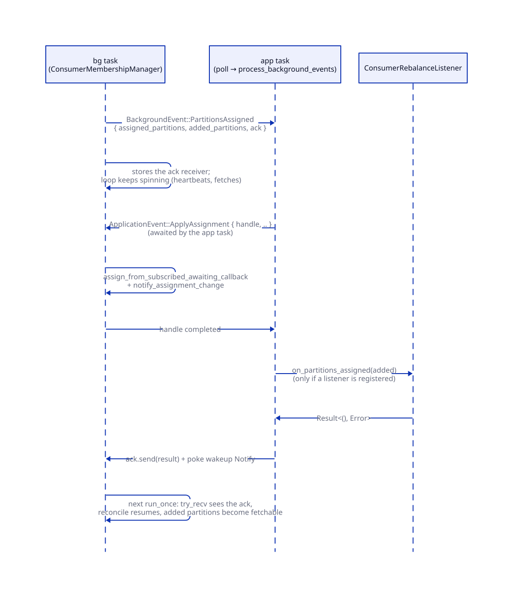
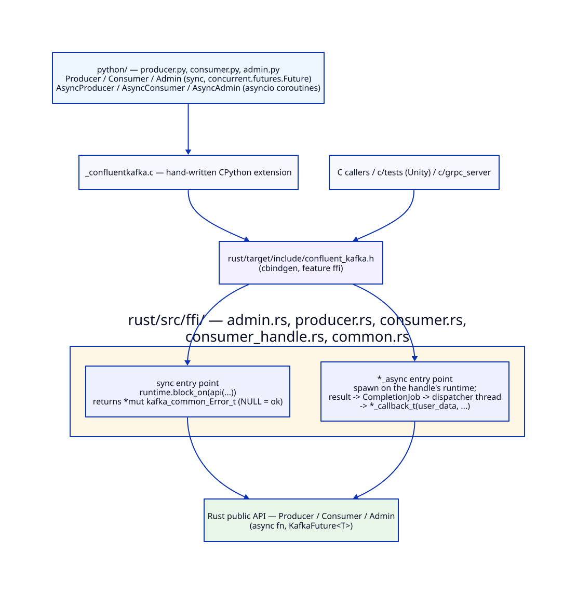

# Project Structure

> **Verified against the tree on 2026-09-27.** File counts below are
> `ls`-derived and will drift; the module *shape* is the durable part.
>
> Diagrams live in `img/` and are rendered from the sibling `.d2` sources with
> `make -C design/current d2`; the `.d2` is the source of truth, so never
> hand-edit an `.svg`. `*.svg` is gitignored repo-wide, so run that command
> once in a fresh clone to make the images appear.

## Top level

The repository is a multi-language monorepo (`rfc/repository-structure.md`):
the Rust client under `rust/`, each binding in its own directory at the root,
and the cross-language `Makefile` and `README.md` at the root beside the
material shared by all languages.

```
rust/                   # the Rust client — Cargo workspace root (see below)
python/                 # Python binding (see "ffi/ and bindings" below)
c/                      # C binding: CMake project, Unity tests, gRPC server
kafka/                  # Java source reference (Apache Kafka, submodule)
design/{current,history}/
rfc/                    # repository-level RFCs
tools/                  # non-Rust tooling: java-perf-test, translation_agent,
                        # deploy_and_run_perf, dependency_graph, ...
.semaphore/  .github/  .githooks/  .claude/
Makefile                # orchestrates rust/, python/ and c/ Makefiles
README.md, CLAUDE.md, LICENSE, service.yml
```

**Where commands run.** `cargo` runs from `rust/`: `rust/rust-toolchain.toml`
and `rust/.cargo/config.toml` (the `cargo xtask` alias) are found from the
current directory, so `cargo --manifest-path rust/Cargo.toml` from the root
would silently use another toolchain and lose `xtask`. As a consequence
xtask's working directory is `rust/`, and it reaches shared material through
`../kafka` and `../design/current`.

**Makefiles.** Each language owns its recipes in its own Makefile —
`rust/Makefile` (every cargo invocation), `python/Makefile` and `c/Makefile` —
and each can be run on its own (`make -C rust test`). The root `Makefile` only
orchestrates: its targets (`build`, `test`, `verify`, `verify-rust`,
`test-c`, ...) delegate to `$(MAKE) -C <language>`, order the builds across
languages (the bindings link the Rust library, so it is built first), and own
what belongs to the whole repository: git submodules and hooks, and the shared
`venv/` the Python targets run in. It passes `REPO_ROOT` /
`RUST_PROJECT_ROOT` down to the binding Makefiles. A binding's
`test-integration` builds its gRPC image(s) and then calls
`make -C rust test-integration-grpc-{python,c}` for the matching arm of the
multilanguage suite.

### `rust/`

```
rust/src/               # 777 .rs files
├── lib.rs              # crate root: module list + generated-code inclusion
│
│   # === Client layer: Java's org.apache.kafka.clients, FLAT in src/ ===
│   # CLAUDE.md §2 forbids `clients` in a folder name, so these sit at the
│   # crate root rather than under a src/clients/ directory. All are private
│   # modules re-exported only as `pub(crate) use` (lib.rs:28-57, :76-104).
├── kafka_client.rs         # KafkaClient trait
├── network_client.rs       # NetworkClient<S, H>
├── network_client_utils.rs
├── metadata.rs, metadata_snapshot.rs, metadata_updater.rs,
│   metadata_recovery_strategy.rs
├── api_versions.rs, node_api_versions.rs
├── client_request.rs, client_response.rs, client_utils.rs
├── cluster_connection_states.rs, connection_state.rs
├── in_flight_requests.rs, least_loaded_node.rs, host_resolver.rs,
│   default_host_resolver.rs
├── fetch_session_handler.rs, common_client_configs.rs
├── mock_client.rs          # #[cfg(test)] only
├── test_alloc_tracker.rs   # #[cfg(test)] only — hot-path allocation budgets
├── integration_tests/      # #[cfg(all(test, feature = "integration-tests"))]:
│                           # api_versions, connection, metadata, ssl_sasl —
│                           # Docker suites that need crate-private types
│
├── admin/              # org.apache.kafka.clients.admin (see below)
├── consumer/           # org.apache.kafka.clients.consumer (see below)
├── producer/           # org.apache.kafka.clients.producer (see below)
├── ffi/                # C FFI, feature-gated on `ffi` (see below)
├── common/             # org.apache.kafka.common (see below)
└── bin/
    ├── consumer_test.rs
    └── message_generator.rs

rust/generator/         # Code generation (formerly src/message/)
├── messages/           # 198 production JSON RPC specs (Apache Kafka 4.3.1)
├── test-messages/      # 4 test-only specs (NullableStruct, SimpleArrays,
│                       # SimpleExample, SimpleRecords)
└── src/
    ├── lib.rs
    └── message/        # org.apache.kafka.message
        ├── code_buffer.rs, versions.rs, field_type.rs, entity_type.rs,
        ├── field_spec.rs, struct_spec.rs, message_spec.rs,
        ├── message_spec_type.rs, request_listener_type.rs
        └── schema_generator.rs

rust/build.rs           # invokes the generator before compilation; writes the
                        # C header to rust/target/include/confluent_kafka.h
rust/xtask/             # format, format-check, check-generated,
                        # generate-error-codes, java-deprecated, lint,
                        # lint-custom, doc-hygiene, lint-fix,
                        # coverage{,-lcov,-all}, test-multilanguage,
                        # producer-perf-test; public-audience-allowlist.txt
rust/tests/             # integration + multilanguage tests (see below)
rust/examples/          # transactional examples (txn_*)
rust/consumer-perf/     # consumer benchmark harness (workspace member)
rust/multilanguage-test-server/  # gRPC protos + server backing the
                                 # multilanguage tests of every language
rust/tools/verifiable-clients/   # Rust verifiable producer/consumer
rust/Makefile          # every cargo invocation of the root Makefile's targets
rust/README.md         # building, testing and linting the crate with cargo
rust/{Cargo.toml, Cargo.lock, rust-toolchain.toml, .cargo/, cbindgen.toml,
      rustfmt.toml, clippy.toml}
```

In the module sections below, trees are rooted at `rust/`, and "`src/`" in
prose means `rust/src/`.

> **Paths that do not exist**, though documents and commit messages in this
> repository still name them: `bindings/` (the bindings moved to `python/` and
> `c/` at the root on 2026-09-27, and everything Rust moved under `rust/`),
> `src/clients/` (its contents are the flat files listed above — CLAUDE.md §2
> forbids the folder name), `src/message/` and a top-level `message-specs/`
> directory (both live in the generator crate now: `rust/generator/src/message/`
> and `rust/generator/messages/`).

## Public surface (2026-09-25)

What the crate exports follows Java's audience, not the module tree. An item
may be public only if its Java class is annotated `@InterfaceAudience.Public`
at Apache Kafka 4.4, is outside every `internal*` package, and is outside the
packages whose `package-info.java` says "not a supported API". C bindings exist
only for public items. `cargo xtask lint-custom`'s `check-public-audience` rule
enforces this, and rustc's `unnameable_types` (enabled in `rust/src/lib.rs`) catches
a crate-private type escaping through a public signature.

In practice:

- The flat client-layer files above (`NetworkClient`, `Metadata`,
  `ApiVersions`, `KafkaClient`, ...) and `CommonClientConfigs` are
  `pub(crate)`.
- `common::{compress, feature, memory, network, protocol, requests, utils}`,
  `common::security::{authenticator, ssl}` and the generated wire modules are
  `pub(crate)`. Tests that need them live inside the crate: the message and
  protocol tests sit under `rust/src/common/`, and the raw-socket integration
  suites under `rust/src/integration_tests/`.
- `consumer::AsyncKafkaConsumer` is `pub(crate)`; `KafkaConsumer::new`
  constructs it and returns it as `Box<dyn Consumer<K, V>>`.
- `Errors` (the wire enum) is `pub(crate)`, so `Error` has no public
  `error()` / `code()`. Callers classify by variant and `is_*_error()`, and C
  callers use `kafka_common_ErrorCode_t`.
- Exceptions (Rust-only types, test helpers such as `MockAdminClient`, JDK
  translations such as `TimeUnit`, C helper handles) are listed, each with its
  reason, in `rust/xtask/public-audience-allowlist.txt`.


*The layer boundaries still match Java's; only the client layer (flattened
into `rust/src/`) and code generation (moved into `rust/generator/`) changed
location.*


*Nothing under `generated/` is checked in — `build.rs` rebuilds it from the
JSON specs, which is why the specs and the generator, not the output, are the
things to read.*

## common/ — org.apache.kafka.common

```
rust/src/common/
├── protocol/       # Readable, Writable, ByteBufferAccessor, Message,
│                   # ApiMessage, varint, api_keys.rs, errors.rs (135 codes),
│                   # message_size_accumulator.rs, object_serialization_cache.rs,
│                   # message_util.rs
├── requests/       # 117 files: RequestBuilder trait, AbstractRequest /
│                   # ConcreteResponse (52 API variants each), RequestHeader,
│                   # ResponseHeader, SendBuilder, RequestUtils
│                   # (is_fatal_error), one file per wire type
├── network/        # 27 files: Selector, Selectable, KafkaChannel,
│                   # TransportLayer (+ plaintext / ssl), ChannelBuilder
│                   # (+ plaintext / ssl / sasl), ChannelBuilders,
│                   # Authenticator, ChannelState, send.rs (`Send` trait),
│                   # receive.rs, network_send.rs, network_receive.rs,
│                   # byte_buffer_send.rs, mock_selector.rs
├── security/       # auth/ (SecurityProtocol, KafkaPrincipal),
│                   # ssl/ (SslFactory), authenticator/, token/delegation/,
│                   # scram/
├── config/         # ssl_configs, sasl_configs, ssl_client_auth,
│                   # config_resource, config_error
├── record/         # timestamp_type.rs + internal/ (record batches,
│                   # MemoryRecords, compression framing)
├── errors/         # 146 files: one payload struct per Java exception
├── message/        # in-crate message / protocol tests
├── compress/       # gzip / snappy / lz4 / zstd
├── serialization/  # Serializer<T>, Deserializer<T> (sync, &[u8])
├── metrics/        # Metrics, Sensor, KafkaMetric, MetricName
├── acl/            # AclOperation, AclPermissionType, AclBinding(+Filter),
│                   # AccessControlEntry(+Filter/Data)
├── resource/       # Resource, ResourcePattern(+Filter), PatternType,
│                   # ResourceType
├── quota/          # ClientQuotaEntity, ClientQuotaFilter(+Component),
│                   # ClientQuotaAlteration
├── internals/      # KafkaFutureImpl, Topic, PartitionStates,
│                   # ClusterResourceListeners
├── feature/, header/, memory/, utils/
├── error.rs        # Error enum (162 variants) + ErrorHierarchy predicates
├── kafka_error.rs  # KafkaError struct (Java's KafkaException)
├── local_{illegal_argument,illegal_state,concurrent_modification,
│   timeout}_error.rs, invalid_record_error.rs
└── node.rs, cluster.rs, topic_partition.rs, topic_id_partition.rs,
    topic_partition_info.rs, topic_partition_replica.rs,
    topic_collection.rs, uuid.rs, kafka_future.rs,
    partition_info.rs, isolation_level.rs, election_type.rs,
    group_state.rs, group_type.rs, classic_group_state.rs,
    cluster_resource{,_listener}.rs,
    metric{,_name,_name_template}.rs
```


*Java's exception hierarchy is flattened into one `Error` enum, one variant
per exception; the intermediate classes become `is_*_error()` predicates, and
fatality is the separate `RequestUtils::is_fatal_error`.*

## producer/ — org.apache.kafka.clients.producer

```
rust/src/producer/
├── mod.rs                  # module re-exports
├── producer.rs             # Producer<K, V> trait (impl Future + Send, no
│                           # #[async_trait]; hot path)
├── dyn_producer.rs         # DynProducer: sealed, boxed-future companion
├── kafka_producer.rs       # KafkaProducer<K, V>
├── mock_producer.rs        # MockProducer
├── producer_config.rs, producer_record.rs, record_metadata.rs, callback.rs
├── partitioner.rs, round_robin_partitioner.rs, mock_partitioner.rs
├── producer_buffer_exhausted_error.rs
└── internals/
    ├── record_accumulator.rs   # per-partition batch deques
    ├── producer_batch.rs, incomplete_batches.rs, buffer_pool.rs
    ├── built_in_partitioner.rs # KeyHasher: CRC-32 (default) / murmur2
    ├── future_record_metadata.rs, produce_request_result.rs
    ├── producer_metadata.rs
    ├── transaction_manager.rs, transactional_request_result.rs,
    │   txn_partition_entry.rs, txn_partition_map.rs
    ├── kafka_producer_metrics.rs, producer_metrics.rs,
    │   sender_metrics_registry.rs
    ├── producer_test_utils.rs
    └── sender.rs               # the producer background task
```


*The app task only appends into the accumulator and returns a future; all
network work happens on the `Sender` task.*



*`transaction_manager.rs` is shared three ways behind one lock; the
Sender-confined fields live on `sender.rs`, not in the manager.*

## consumer/ — org.apache.kafka.clients.consumer

```
rust/src/consumer/               # 22 files + 51 internals + 9 events
├── mod.rs                  # Consumer<K, V> trait
├── kafka_consumer.rs       # KafkaConsumer::new -> Box<dyn Consumer<K, V>>
├── async_kafka_consumer.rs # AsyncKafkaConsumer<K, V> (pub(crate))
│                           # + ConsumerHandle (pub)
├── mock_consumer.rs        # MockConsumer<K, V>
├── consumer_config.rs, consumer_record.rs, consumer_records.rs,
│   consumer_group_metadata.rs, consumer_rebalance_listener.rs,
│   consumer_rebalance_listener_method_name.rs, offset_commit_callback.rs,
│   offset_and_metadata.rs, offset_and_timestamp.rs,
│   group_protocol.rs, close_options.rs,
│   subscription_pattern.rs, interceptor.rs,
│   consumer_{commit_failed,retriable_commit_failed,offset_out_of_range,
│   no_offset_for_partition,log_truncation}_error.rs,
│   consumer_partition_assignor.rs   # Assignment/Subscription holders only
└── internals/
    ├── consumer_network_thread.rs   # the background task (run_once)
    ├── network_client_delegate.rs   # the bg task's handle on NetworkClient
    ├── request_managers.rs, request_manager.rs
    ├── coordinator_request_manager.rs, commit_request_manager.rs
    ├── consumer_heartbeat_request_manager.rs,
    │   abstract_heartbeat_request_manager.rs, heartbeat_request_state.rs
    ├── consumer_membership_manager.rs, abstract_membership_manager.rs,
    │   member_state.rs, member_state_listener.rs
    ├── fetch_request_manager.rs, abstract_fetch.rs, fetch_buffer.rs,
    │   fetch_collector.rs, completed_fetch.rs, fetch_config.rs,
    │   fetch_utils.rs
    ├── offsets_request_manager.rs, offset_fetcher_utils.rs,
    │   offsets_for_leader_epoch_client.rs, offset_and_timestamp_internal.rs
    ├── topic_metadata_request_manager.rs, consumer_metadata.rs
    ├── subscription_state.rs, auto_offset_reset_strategy.rs,
    │   auto_offset_reset_strategy_test.rs, positions_validator.rs
    ├── consumer_rebalance_listener_invoker.rs,
    │   offset_commit_callback_invoker.rs
    ├── consumer_protocol.rs         # decodes classic members' assignment
    │                                # bytes for the admin group-describe path
    ├── deserializers.rs, consumer_interceptors.rs, consumer_utils.rs
    ├── wakeup_trigger.rs, request_state.rs, timed_request_state.rs
    ├── async_consumer_metrics.rs, kafka_consumer_metrics.rs,
    │   fetch_metrics_manager.rs, fetch_metrics_aggregator.rs,
    │   fetch_metrics_registry.rs, heartbeat_metrics_manager.rs,
    │   offset_commit_metrics_manager.rs,
    │   consumer_rebalance_metrics_manager.rs,
    │   rebalance_callback_metrics_manager.rs, sensor_builder.rs
    └── events/
        ├── application_event.rs, application_event_handler.rs,
        │   application_event_processor.rs
        ├── background_event.rs, background_event_handler.rs
        ├── completable_event.rs, completable_event_reaper.rs
        └── event_processor.rs
```


*`run_once()` phase order is Java's `runOnce()`; phase 4 is a plain
`.await` that wakeups interrupt via the selector's `Notify` rather than
cancelling.*


*Rebalance listeners and commit callbacks always run inline on the app
task; the bg loop gates only the membership transition on their ack.*



*`PartitionsAssigned` → `ApplyAssignment` → listener → ack: the assignment is
installed on the bg task, but only when `poll()` asks for it.*


*`fetch_buffer.rs` / `completed_fetch.rs` / `fetch_collector.rs` are one
pipeline over a single owned buffer — read them in that order.*

## ffi/ and bindings

```
rust/src/ffi/           # feature-gated: --features ffi
├── mod.rs
├── common.rs           # kafka_common_Error_t & co. (57 exported symbols)
│                       # + the callback dispatcher: CompletionJob,
│                       # spawn_dispatcher, enqueue_or_run_inline
├── producer.rs         # 62 exported symbols (12 of them *_async)
├── consumer.rs         # 156 exported symbols (22 of them *_async)
├── consumer_handle.rs  # 23 exported symbols (1 of them *_async)
└── admin.rs            # 490 exported symbols (47 of them *_async)

c/
├── CMakeLists.txt, Makefile, Dockerfile.grpc
├── tests/{test_kafka_producer,test_kafka_consumer,test_kafka_admin,
│          test_mock_producer,test_mock_consumer,test_mock_admin,
│          test_consumer_callbacks,producer_perf_test}.c + unity/ (submodule)
└── grpc_server/        # C backend for the multilanguage tests

python/
├── producer.py, consumer.py, admin.py
├── _confluentkafka.c   # hand-written C extension
├── _error_code.py      # generated from rust/src/ffi/common.rs by
│                       # tools/generate_error_code.py
├── grpc_server.py, grpc_server_async.py, grpc_translate.py
├── Dockerfile.grpc, Dockerfile.grpc.async
├── test/{unit,static,performance}/, soak/, tools/
└── setup.py, pyproject.toml, Makefile
```

Symbol counts are `#[unsafe(no_mangle)]` occurrences per file (2026-09-27).

Both bindings link the library cargo builds under `rust/target/<profile>/` and
compile against `rust/target/include/confluent_kafka.h`: `c/CMakeLists.txt`
defaults `RUST_PROJECT_ROOT` to `../rust`, and `python/setup.py` resolves
`../rust` (overridable with `CONFLUENT_KAFKA_LIB_DIR`).

The bindings expose each operation twice: a synchronous entry point that
`block_on`s the async API on the runtime the handle owns, and an `*_async`
one that takes a `*_callback_t` + `user_data`, spawns the future and delivers
the result through a dispatcher thread (`spawn_dispatcher` /
`enqueue_or_run_inline` in `rust/src/ffi/common.rs`). The rest of the exported
symbols are the sync forms, the accessors and the destructors.



*Python and C both reach the Rust API through the same header and the same
two entry-point shapes; neither binding adds a runtime of its own.*

## tests/

```
rust/tests/                  # 59 .rs files across 4 cargo test targets
├── common/             # shared infrastructure, included by the targets
│   ├── mod.rs
│   ├── cluster_config.rs       # ClusterConfig, SecurityMode,
│   │                           # authorizer_single_broker() fixture
│   ├── cluster_pool.rs         # process-global pool of shared containers
│   ├── kafka_cluster.rs        # Docker wrapper (KAFKA_TAG 4.2.0)
│   ├── backend_factory.rs, backend_pool.rs, admin_backend.rs
│   ├── multilanguage_{producer,consumer,admin}.rs,
│   │   multilanguage_{test,consumer_test,admin_test}_macro.rs
│   ├── callback_log.rs, error_code.rs
│   └── test_certs.rs, test_context.rs, test_utils.rs
├── producer/           # target `producer`: main.rs + mock_producer_test.rs
├── consumer/           # target `consumer`: main.rs, async_kafka_consumer_test.rs,
│                       # mock_consumer_test.rs, trait_surface_check.rs,
│                       # consumer_config_test.rs, consumer_record(s)_test.rs,
│                       # offset_and_metadata_test.rs, close_options_test.rs
├── performance/        # target `performance`, `test = false` in Cargo.toml —
│                       # excluded from plain `cargo test`; run explicitly
└── integration/        # 27 test files + main.rs, Docker required
    ├── producer_test.rs, producer_transactions_test.rs
    ├── consumer_test.rs, consumer_topic_creation_test.rs,
    │   plaintext_consumer{,_assign,_callback,_commit,_fetch,_poll,
    │   _subscription}_test.rs, sasl_ssl_consumer_test.rs
    ├── multilanguage_{consumer,admin}_test.rs
    └── admin_{topics,partitions_records,cluster_configs,log_dirs,
        elections_reassignments_offsets,groups,group_offsets,acls,quotas,
        features,transactions,scram,delegation_tokens}_test.rs
```

There is no `common` test target and no `rust/tests/main.rs` any more. The
message and protocol tests that used to live under `tests/common/` moved
inside the crate (`rust/src/common/message/` and neighbours), because the
generated wire types are now `pub(crate)`. The raw-socket suites
(`connection`, `api_versions`, `metadata`, `ssl_sasl`) moved to
`rust/src/integration_tests/` for the same reason.

Three of the four targets are declared in `Cargo.toml`; `integration` is not —
Cargo auto-discovers `rust/tests/integration/main.rs`. That file is guarded by
`#![cfg(feature = "integration-tests")]`, so the target still compiles (to
nothing) without the feature.

---

# Admin module (org.apache.kafka.clients.admin)

**84 top-level files + 32 `internals/` + 45 `options/`** (each count includes
its `mod.rs`), covering 44 RPCs.
The layout is regular: for each RPC there is one `*_result.rs` at the top
level, one `options/*_options.rs`, and — if the RPC needs a lookup before it
can be sent — one `internals/*_handler.rs`. The listings below group the files
by what they administer.

The 44 RPCs, in `Admin` trait declaration order:
`create_topics`, `delete_topics`, `list_topics`, `describe_topics`,
`create_partitions`, `delete_records`, `describe_producers`,
`abort_transaction`, `describe_transactions`, `fence_producers`,
`list_transactions`, `force_terminate_transaction`, `describe_cluster`,
`describe_configs`, `incremental_alter_configs`, `list_config_resources`,
`describe_log_dirs`, `alter_replica_log_dirs`,
`describe_replica_log_dirs`, `elect_leaders`, `alter_partition_reassignments`,
`list_partition_reassignments`, `list_offsets`, `list_groups`,
`describe_consumer_groups`, `describe_classic_groups`,
`list_consumer_group_offsets`, `alter_consumer_group_offsets`,
`delete_consumer_group_offsets`, `delete_consumer_groups`,
`remove_members_from_consumer_group`, `create_acls`, `describe_acls`,
`delete_acls`, `describe_client_quotas`, `alter_client_quotas`,
`describe_user_scram_credentials`, `alter_user_scram_credentials`,
`create_delegation_token`, `renew_delegation_token`,
`expire_delegation_token`, `describe_delegation_token`, `describe_features`,
`update_features` — plus `async fn close` / `close_with_timeout`. Java's
deprecated `listConsumerGroups` and `listClientMetricsResources` are not
translated (CLAUDE.md §3).

## Core: trait, client, dispatch

```
rust/src/admin/
├── mod.rs                    # Admin trait (94 sync fn + async close /
│                             # close_with_timeout)
├── admin_client.rs           # AdminClient::create() factory -> Box<dyn Admin>
├── admin_client_config.rs    # AdminClientConfig (incl. security settings)
├── kafka_admin_client.rs     # KafkaAdminClient (owns NetworkClient + bg task)
├── mock_admin_client.rs      # MockAdminClient::create (in-memory fake)
└── internals/
    ├── call.rs                     # Call + NodeProvider + MaybeRetryOutcome
    ├── admin_metadata_manager.rs   # cluster / controller / backoff state
    ├── admin_utils.rs
    ├── admin_client_runnable.rs    # the single tokio::spawn background task
    │                               # AdminClientRunnable<C: KafkaClient>
    ├── admin_api_driver.rs         # lookup -> fulfillment engine
    ├── admin_api_handler.rs, admin_api_lookup_strategy.rs,
    │   admin_api_future.rs, api_request_scope.rs
    ├── partition_leader_strategy.rs, partition_leader_cache.rs,
    │   coordinator_strategy.rs, coordinator_key.rs,
    │   all_brokers_strategy.rs, static_broker_strategy.rs
    └── partition_leader_strategy_integration_test.rs
```

The `Call` path serves RPCs whose node is known up front; the driver path
serves the ones that must resolve a partition leader, a group/transaction
coordinator, or the broker set first. Both run on the one background task.

## Topics, partitions, records

```
rust/src/admin/
├── new_topic.rs, topic_listing.rs, topic_description.rs,
│   new_partitions.rs, records_to_delete.rs, deleted_records.rs
├── {create,delete,list,describe}_topics_result.rs,
│   create_partitions_result.rs, delete_records_result.rs
├── options/{create,delete,list,describe}_topics_options.rs,
│           create_partitions_options.rs, delete_records_options.rs
└── internals/delete_records_handler.rs        # PartitionLeaderStrategy

rust/src/common/topic_collection.rs, rust/src/common/topic_partition_info.rs
rust/src/common/requests/{create_topics,delete_topics,create_partitions,
                     delete_records}_{request,response}.rs
rust/tests/integration/admin_{topics,partitions_records}_test.rs
```

`describe_topics` (by name and by id) goes through the Metadata API, mirroring
Java's `generateDescribeTopicsCallWithMetadataApi` / `handleDescribeTopicsByIds`
rather than `DescribeTopicPartitions` cursor pagination.

## Cluster, configs, log dirs

```
rust/src/admin/
├── config.rs, config_entry.rs, alter_config_op.rs
├── log_dir_description.rs, replica_info.rs
├── describe_cluster_result.rs, describe_configs_result.rs,
│   alter_configs_result.rs, list_config_resources_result.rs,
│   describe_log_dirs_result.rs, alter_replica_log_dirs_result.rs,
│   describe_replica_log_dirs_result.rs
└── options/{describe_cluster,describe_configs,alter_configs,
            list_config_resources,describe_log_dirs,alter_replica_log_dirs,
            describe_replica_log_dirs}_options.rs

rust/src/common/config/config_resource.rs, rust/src/common/topic_partition_replica.rs
rust/src/common/acl/{acl_operation.rs, acl_permission_type.rs}   # authorized_operations
rust/src/common/requests/{describe_cluster,describe_configs,
                     incremental_alter_configs,list_config_resources,
                     describe_log_dirs,alter_replica_log_dirs}_{request,response}.rs
rust/tests/integration/admin_{cluster_configs,log_dirs}_test.rs
```

All on the plain `Call` path, but not all to the same node: config requests are
routed per resource type (broker / broker-logger resources to that broker,
everything else to the controller or least-loaded node), and log-dir requests
fan out per broker. `describe_replica_log_dirs` is built on
`DescribeLogDirsRequest` and reshaped into current/future-dir `ReplicaLogDirInfo`.
The log-dirs integration suite drives a real cross-directory replica move
against a broker fixture with two `KAFKA_LOG_DIRS`.

## Elections, reassignments, offsets

```
rust/src/admin/
├── offset_spec.rs, new_partition_reassignment.rs, partition_reassignment.rs
├── elect_leaders_result.rs, alter_partition_reassignments_result.rs,
│   list_partition_reassignments_result.rs, list_offsets_result.rs
├── options/{elect_leaders,alter_partition_reassignments,
│           list_partition_reassignments,list_offsets}_options.rs
└── internals/list_offsets_handler.rs          # PartitionLeaderStrategy

rust/src/common/election_type.rs
rust/src/common/requests/{elect_leaders,alter_partition_reassignments,
                     list_partition_reassignments}_{request,response}.rs
# ListOffsets{Request,Response} is the consumer module's wrapper, reused
rust/tests/integration/admin_elections_reassignments_offsets_test.rs
```

## Groups and group offsets

```
rust/src/admin/
├── group_listing.rs,
│   consumer_group_description.rs, classic_group_description.rs,
│   member_description.rs, member_assignment.rs, member_to_remove.rs,
│   list_consumer_group_offsets_spec.rs
├── {list_groups,describe_consumer_groups,
│    describe_classic_groups,list_consumer_group_offsets,
│    alter_consumer_group_offsets,delete_consumer_group_offsets,
│    delete_consumer_groups,remove_members_from_consumer_group}_result.rs
└── internals/                                  # all CoordinatorStrategy
    ├── describe_consumer_groups_handler.rs, describe_classic_groups_handler.rs
    ├── list_consumer_group_offsets_handler.rs,
    │   alter_consumer_group_offsets_handler.rs,
    │   delete_consumer_group_offsets_handler.rs
    └── delete_groups_handler.rs, delete_consumer_groups_handler.rs,
        remove_members_from_consumer_group_handler.rs

rust/src/common/{group_state.rs, group_type.rs, classic_group_state.rs}
rust/src/consumer/internals/consumer_protocol.rs   # decodes a classic member's
rust/src/consumer/consumer_partition_assignor.rs   # assignment bytes (data holders
                                              # only; no assignor trait)
rust/src/common/requests/{list_groups,consumer_group_describe,describe_groups,
                     delete_groups,leave_group,offset_delete}_{request,response}.rs
rust/tests/integration/admin_{groups,group_offsets}_test.rs
```

## ACLs, quotas, SCRAM, tokens, features, transactions, client metrics

```
rust/src/admin/
├── {create,describe,delete}_acls_result.rs
├── {describe,alter}_client_quotas_result.rs
├── {describe,alter}_user_scram_credentials_result.rs,
│   scram_credential_info.rs, scram_mechanism.rs,
│   user_scram_credential_{alteration,deletion,upsertion}.rs,
│   user_scram_credentials_description.rs
├── {create,renew,expire,describe}_delegation_token_result.rs
├── feature_metadata.rs, feature_update.rs, finalized_version_range.rs,
│   supported_version_range.rs, {describe,update}_features_result.rs
├── producer_state.rs, transaction_state.rs, transaction_description.rs,
│   transaction_listing.rs, abort_transaction_spec.rs,
│   {describe_producers,describe_transactions,abort_transaction,
│    fence_producers,list_transactions,terminate_transaction}_result.rs
└── internals/{describe_producers,describe_transactions,abort_transaction,
              fence_producers,list_transactions}_handler.rs

rust/src/common/acl/{acl_binding.rs, acl_binding_filter.rs,
                access_control_entry{,_filter,_data}.rs}
rust/src/common/resource/{resource.rs, resource_pattern{,_filter}.rs,
                     pattern_type.rs, resource_type.rs}
rust/src/common/quota/{client_quota_entity, client_quota_filter,
                  client_quota_filter_component, client_quota_alteration}.rs
rust/src/common/security/{auth/kafka_principal.rs,
                     token/delegation/{delegation_token,token_information}.rs,
                     scram/internals/{scram_formatter,scram_mechanism}.rs}
rust/tests/integration/admin_{acls,quotas,scram,delegation_tokens,features,
                          transactions}_test.rs
```

The transaction RPCs are the users of
`AllBrokersStrategy` and `StaticBrokerStrategy`. `force_terminate_transaction`
is the one RPC whose files are named for the Java `terminateTransaction`
spelling (`terminate_transaction_{result,options}.rs`).

`AdminClientConfig` now carries `security.protocol` and the SSL / SASL
settings, and `KafkaAdminClient::new` builds its channel builder from them
(`kafka_admin_client.rs:325`). The delegation-token and SCRAM suites still
create and describe credentials without authenticating with them. The reason
is no longer a PLAINTEXT-only admin client. It is that only SASL/PLAIN is
implemented, and both credential kinds are used through SASL/SCRAM.
`rust/tests/integration/admin_scram_test.rs:66-71` still gives the old
reason.


*Each client owns its own background task and its own `NetworkClient`;
nothing is shared between a producer, a consumer and an admin client.*


*Which `internals/` file you need depends on this fork: a plain `Call` needs
no handler, a lookup-first RPC has one `*_handler.rs` plus a strategy.*
