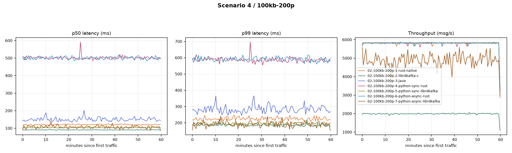

# high_msg_size_200p_1MB_batch_size

**Config:** 100 KB messages, 200 partitions, `batch.size=1MB` (uniform across all clients), `acks=all`, `linger.ms=5`, `enable.idempotence=false`, `compression.type=none`, `buffer.memory=32MB`, `max.in.flight.requests.per.connection=5` (rust/java) / `1000` (librdkafka), 300s warmup + 3600s measured.

## Results

| Client | Msgs | Throughput (msg/s) | Throughput (MiB/s) | p50 | p90 | p95 | p99 | p999 | max | avg | CPU % | RSS (MiB) |
|---|---|---|---|---|---|---|---|---|---|---|---|---|
| rust (native) | 20,931,701 | 5,814.2 | 567.8 | 119 | 182 | 206 | 264 | 350 | 671 | 127.3 | 83.5 | 1,098.7 |
| librdkafka (C) | 7,180,000 | 1,993.2 | 194.6 | 90 | 152 | 163 | 193 | 240 | 507 | 91.9 | 18.8 | 1,075.2 |
| java | 20,970,000 | 5,822.8 | 568.6 | 144 | 242 | 284 | 386 | 530 | 778 | 158.8 | 48.3 | 3,340.1 |
| python-sync (rust) | 20,950,000 | 5,815.5 | 567.9 | 503 | 589 | 620 | 696 | 836 | 3,741 | 514.2 | 92.0 | 1,142.4 |
| python-sync (librdkafka) | 20,990,000 | 5,827.1 | 569.0 | 103 | 153 | 172 | 217 | 284 | 847 | 110.1 | 74.0 | 1,141.4 |
| python-async (rust) | 20,950,000 | 5,815.8 | 568.0 | 502 | 592 | 626 | 702 | 807 | 935 | 513.0 | 90.7 | 1,124.6 |
| python-async (librdkafka) | 17,639,809 | 4,898.1 | 478.3 | 94 | 161 | 190 | 246 | 304 | 510 | 105.4 | 123.7 | 1,531.8 |

**Note:** librdkafka (C) here (1,993.15 msg/s, full 3602.33s duration, cpu=18.8%) is essentially identical to the 36-partition scenario's number (1,992.94 msg/s) — throughput is unaffected by partition count, pointing at a fixed client-side cap rather than anything broker/network-related. Same open question as the 36-partition scenario, not resolved in this dataset.

## Comparison graph

