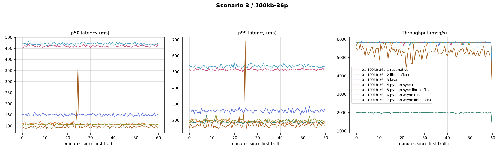

# high_msg_size_36p_1MB_batch_size

**Config:** 100 KB messages, 36 partitions, `batch.size=1MB` (uniform across all clients), `acks=all`, `linger.ms=5`, `enable.idempotence=false`, `compression.type=none`, `buffer.memory=32MB`, `max.in.flight.requests.per.connection=5` (rust/java) / `1000` (librdkafka), 300s warmup + 3600s measured.

## Results

| Client | Msgs | Throughput (msg/s) | Throughput (MiB/s) | p50 | p90 | p95 | p99 | p999 | max | avg | CPU % | RSS (MiB) |
|---|---|---|---|---|---|---|---|---|---|---|---|---|
| rust (native) | 20,967,332 | 5,824.1 | 568.8 | 108 | 154 | 172 | 212 | 283 | 713 | 113.5 | 78.8 | 1,092.4 |
| librdkafka (C) | 7,180,000 | 1,992.9 | 194.6 | 90 | 152 | 163 | 195 | 239 | 1,695 | 92.0 | 18.2 | 1,087.7 |
| java | 20,970,000 | 5,822.7 | 568.6 | 147 | 220 | 245 | 298 | 366 | 526 | 155.1 | 41.9 | 3,334.3 |
| python-sync (rust) | 20,990,000 | 5,826.3 | 569.0 | 461 | 514 | 533 | 574 | 626 | 689 | 467.4 | 82.2 | 1,131.6 |
| python-sync (librdkafka) | 20,980,000 | 5,825.2 | 568.9 | 106 | 157 | 177 | 221 | 283 | 832 | 112.5 | 69.7 | 1,143.3 |
| python-async (rust) | 20,980,000 | 5,824.5 | 568.8 | 472 | 536 | 558 | 602 | 671 | 977 | 479.9 | 84.0 | 1,119.4 |
| python-async (librdkafka) | 19,133,492 | 5,312.8 | 518.8 | 90 | 135 | 159 | 218 | 288 | 6,247 | 97.3 | 131.1 | 1,457.8 |

**Note:** librdkafka (C)'s throughput here (~1,993 msg/s, full 3602.72s measured window) is a real, reproducible ceiling specific to this client at 100KB messages — confirmed via a full-duration rerun, not a smoke-test artifact. `cpu_avg_pct=18.2` here is far below every other client's 40-90%+, suggesting the client is self-throttling (buffer/queue backpressure) rather than CPU-bound. Root cause not resolved in this dataset.

## Comparison graph

