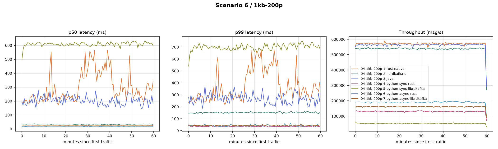

# low_msg_size_200p_16KB_batch_size

**Config:** 1 KB messages, 200 partitions, `batch.size=16KB` for the rust/java family, `batch.size=1MB` for the librdkafka family, `acks=all`, `linger.ms=5`, `enable.idempotence=false`, `compression.type=none`, `buffer.memory=32MB`, `max.in.flight.requests.per.connection=5` (rust/java) / `1000` (librdkafka), 300s warmup + 3600s measured.

**java and python-sync (rust) rows are the 2026-08-24 rerun** — the original runs of these two cases hit a severe, later-found-to-be-non-reproducible memory/latency blowup (e.g. java RSS reaching 8.5GB, avg latency 372.1ms). See the repo's `kafka-perf-report-2026-08-23.md` §1 for the original numbers and investigation notes; this table and the comparison graph use the healthy reruns.

## Results

| Client | Msgs | Throughput (msg/s) | Throughput (MiB/s) | p50 | p90 | p95 | p99 | p999 | max | avg | CPU % | RSS (MiB) |
|---|---|---|---|---|---|---|---|---|---|---|---|---|
| rust (native) | 2,057,311,740 | 571,443.3 | 558.0 | 254 | 523 | 650 | 1,005 | 1,566 | 1,818 | 302.1 | 255.9 | 228.7 |
| librdkafka (C) | 1,942,230,000 | 539,348.3 | 526.7 | 34 | 84 | 105 | 152 | 219 | 587 | 44.6 | 247.0 | 1,322.2 |
| java [rerun] | 2,030,770,000 | 563,935.5 | 550.7 | 182 | 308 | 356 | 465 | 546 | 678 | 205.7 | 144.7 | 4,097.7 |
| python-sync (rust) [rerun] | 472,440,000 | 131,195.5 | 128.1 | 15 | 25 | 31 | 39 | 117 | 278 | 17.3 | 168.9 | 142.8 |
| python-sync (librdkafka) | 193,160,000 | 53,636.6 | 52.4 | 607 | 694 | 719 | 774 | 852 | 959 | 610.1 | 119.8 | 252.4 |
| python-async (rust) | 692,480,000 | 192,299.5 | 187.8 | 16 | 31 | 36 | 50 | 251 | 427 | 19.6 | 198.7 | 160.5 |
| python-async (librdkafka) | 585,950,000 | 162,713.8 | 158.9 | 27 | 34 | 38 | 47 | 64 | 281 | 27.9 | 130.8 | 316.7 |

## Comparison graph

