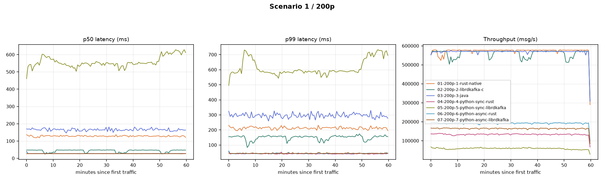

# low_msg_size_200p_1MB_batch_size

**Config:** 1 KB messages, 200 partitions, `batch.size=1MB` (uniform across all clients), `acks=all`, `linger.ms=5`, `enable.idempotence=false`, `compression.type=none`, `buffer.memory=32MB`, `max.in.flight.requests.per.connection=5` (rust/java) / `1000` (librdkafka), 300s warmup + 3600s measured.

## Results

| Client | Msgs | Throughput (msg/s) | Throughput (MiB/s) | p50 | p90 | p95 | p99 | p999 | max | avg | CPU % | RSS (MiB) |
|---|---|---|---|---|---|---|---|---|---|---|---|---|
| rust (native) | 2,068,950,476 | 574,692.3 | 561.2 | 126 | 184 | 206 | 256 | 329 | 477 | 133.9 | 176.8 | 155.1 |
| librdkafka (C) | 2,019,390,000 | 560,773.4 | 547.6 | 44 | 92 | 110 | 154 | 216 | 494 | 51.4 | 229.8 | 548.3 |
| java | 2,053,320,000 | 570,195.4 | 556.8 | 161 | 256 | 292 | 376 | 508 | 805 | 172.9 | 84.1 | 2,623.3 |
| python-sync (rust) | 482,350,000 | 133,945.5 | 130.8 | 27 | 34 | 37 | 46 | 115 | 255 | 28.2 | 135.9 | 191.7 |
| python-sync (librdkafka) | 213,200,000 | 59,199.2 | 57.8 | 551 | 612 | 655 | 718 | 805 | 968 | 552.6 | 119.2 | 257.0 |
| python-async (rust) | 692,780,000 | 192,383.0 | 187.9 | 27 | 35 | 39 | 48 | 111 | 447 | 28.5 | 153.5 | 195.6 |
| python-async (librdkafka) | 593,150,000 | 164,715.4 | 160.8 | 27 | 34 | 37 | 47 | 63 | 270 | 27.8 | 130.8 | 316.6 |

## Comparison graph

