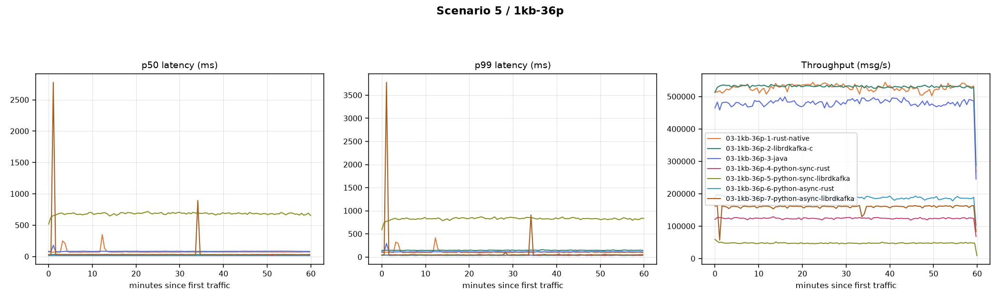

# low_msg_size_36p_16KB_batch_size

**Config:** 1 KB messages, 36 partitions, `batch.size=16KB` for the rust/java family, `batch.size=1MB` for the librdkafka family, `acks=all`, `linger.ms=5`, `enable.idempotence=false`, `compression.type=none`, `buffer.memory=32MB`, `max.in.flight.requests.per.connection=5` (rust/java) / `1000` (librdkafka), 300s warmup + 3600s measured.

**rust (native) row is the 2026-08-24 rerun** — the original run hit a severe, later-found-to-be-non-reproducible memory/latency blowup (RSS reaching 36.5GB, avg latency 4,599.8ms). See the repo's `kafka-perf-report-2026-08-23.md` §1 for the original numbers and investigation notes; this table and the comparison graph use the healthy rerun.

## Results

| Client | Msgs | Throughput (msg/s) | Throughput (MiB/s) | p50 | p90 | p95 | p99 | p999 | max | avg | CPU % | RSS (MiB) |
|---|---|---|---|---|---|---|---|---|---|---|---|---|
| rust (native) [rerun] | 1,899,248,943 | 527,554.5 | 515.2 | 71 | 89 | 101 | 241 | 1,667 | 3,064 | 81.2 | 222.9 | 258.8 |
| librdkafka (C) | 1,913,630,000 | 531,407.2 | 519.0 | 32 | 81 | 102 | 146 | 204 | 553 | 42.3 | 261.7 | 1,064.3 |
| java | 1,732,390,000 | 481,075.9 | 469.8 | 83 | 102 | 109 | 128 | 272 | 4,028 | 87.5 | 141.8 | 3,302.4 |
| python-sync (rust) | 447,520,000 | 124,274.9 | 121.4 | 16 | 25 | 30 | 40 | 111 | 239 | 17.8 | 163.4 | 123.1 |
| python-sync (librdkafka) | 172,700,000 | 47,954.6 | 46.8 | 681 | 807 | 840 | 911 | 1,007 | 1,219 | 682.5 | 119.4 | 258.5 |
| python-async (rust) | 676,390,000 | 187,831.0 | 183.4 | 17 | 30 | 36 | 53 | 253 | 377 | 20.1 | 192.0 | 126.3 |
| python-async (librdkafka) | 573,708,024 | 159,309.5 | 155.6 | 28 | 35 | 39 | 53 | >10000 | 25,284 | 91.7 | 129.7 | 1,189.4 |

`>10000` = the harness's latency histogram overflow bucket ("more than 10 seconds", not a literal value; the histogram is capped at `MAX_LATENCY_MS=10000` for bounded memory on long runs).

## Comparison graph

