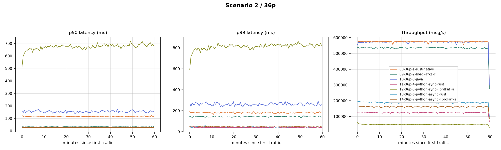

# low_msg_size_36p_1MB_batch_size

**Config:** 1 KB messages, 36 partitions, `batch.size=1MB` (uniform across all clients), `acks=all`, `linger.ms=5`, `enable.idempotence=false`, `compression.type=none`, `buffer.memory=32MB`, `max.in.flight.requests.per.connection=5` (rust/java) / `1000` (librdkafka), 300s warmup + 3600s measured.

## Results

| Client | Msgs | Throughput (msg/s) | Throughput (MiB/s) | p50 | p90 | p95 | p99 | p999 | max | avg | CPU % | RSS (MiB) |
|---|---|---|---|---|---|---|---|---|---|---|---|---|
| rust (native) | 2,067,550,631 | 574,303.5 | 560.8 | 114 | 157 | 173 | 207 | 253 | 350 | 119.3 | 194.6 | 147.0 |
| librdkafka (C) | 1,926,870,000 | 535,082.7 | 522.5 | 32 | 82 | 102 | 143 | 197 | 402 | 42.7 | 258.6 | 1,295.1 |
| java | 2,058,070,000 | 571,516.9 | 558.1 | 151 | 227 | 255 | 311 | 385 | 555 | 159.5 | 90.3 | 2,680.3 |
| python-sync (rust) | 446,670,000 | 124,038.1 | 121.1 | 25 | 32 | 35 | 44 | 122 | 271 | 26.4 | 133.5 | 200.3 |
| python-sync (librdkafka) | 175,230,000 | 48,655.9 | 47.5 | 670 | 790 | 821 | 899 | 995 | 1,271 | 672.7 | 119.4 | 253.6 |
| python-async (rust) | 677,940,000 | 188,259.4 | 183.8 | 27 | 34 | 38 | 49 | 157 | 346 | 28.2 | 152.8 | 179.6 |
| python-async (librdkafka) | 579,760,000 | 160,994.1 | 157.2 | 27 | 35 | 39 | 49 | 66 | 262 | 28.5 | 130.7 | 319.5 |

## Comparison graph

